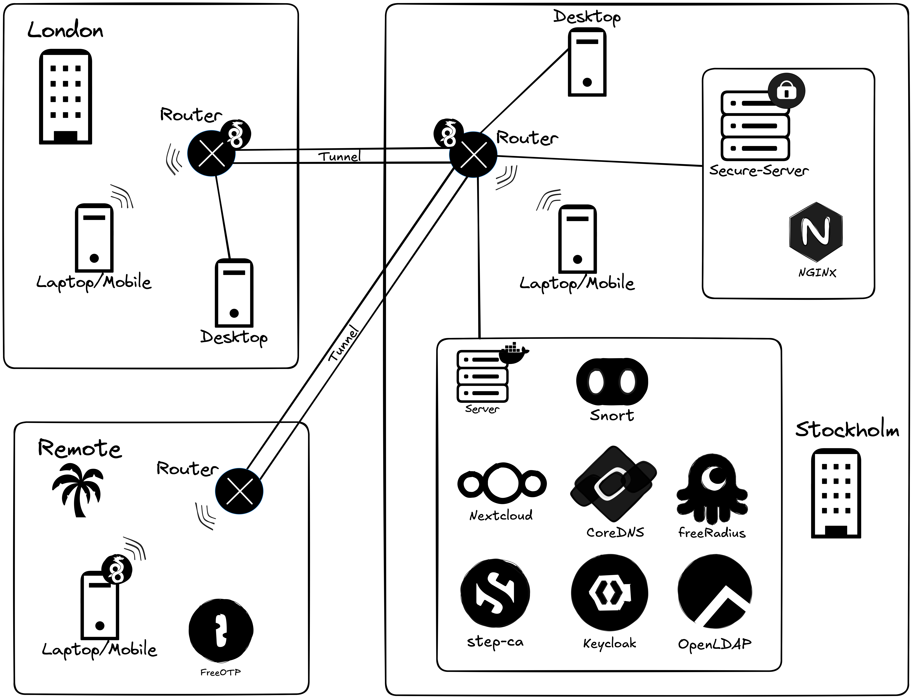

# ACME

## Network Structure



## Materials
- [ASUS RT-AC68U](https://www.asus.com/networking-iot-servers/wifi-routers/asus-wifi-routers/rtac68u/) Router (Quantity: 2)
- [Redmi Note 11](https://www.gsmarena.com/xiaomi_redmi_note_11-11336.php) Phone (Quantity: 1)
- Networking cables (Quantity: 2)

## Router Setup
Update the firmware of the router to the most recent one by following the instructions provided [here](https://www.gsmarena.com/xiaomi_redmi_note_11-11336.php). In case the router needs to be debricked, use [this](https://www.asus.com/networking-iot-servers/wifi-routers/asus-wifi-routers/rtac68u/helpdesk_download/?model2Name=RTAC68U) tool. Restore to RT-AC68U_3.0.0.4_386_41634-g08f88ae first when debricking, then flash any firmware you wish (we used  DD-WRT v3.0-r59661 std (02/14/25)).</br>
Once the new firmware is installed, define new user and password for each router so that only you have access to them.</br>
In the router you want to use in the Stockholm site do the following:</br>
- **Setup**->**Basic Setup**->**Router Name** and change the name to G1-Stockholm.
- **Setup**->**Basic Setup**->**Local IP Address** and change it to 192.168.0.1/24 
- **Wireless**->**Basic Settings**->**Service Set Identifier** and change it to G1-Stockholm
- **Services**->**Services**->**Secure Shell** enable the daemon and add a SSH public key to it.</br>

In the router you want to use in the London site do the following:</br>
- **Setup**->**Basic Setup**->**Router Name** and change the name to G1-London.
- **Setup**->**Basic Setup**->**Local IP Address** and change it to 192.168.1.1/24 
- **Wireless**->**Basic Settings**->**Service Set Identifier** and change it to G1-London
- **Services**->**Services**->**Secure Shell** enable the daemon and add a SSH public key to it.

## Site-to-Site VPN
To create a site-to-site VPN we used the Wireguard of the router. To set this up, do the following:</br>
- In the Stockholm router:
  - **Setup**->**Tunnels** and click on **Add Tunnel**.
  - Enable **Tunnel**
  - **Protocol Type** WireGuard
  - **CVE-2019-14899 Mitigation** Unchecked
  - **NAT Via Tunnel** Unchecked
  - **Tunnel Obfuscation** Disable
  - **Listen Port**: 51820
  - **MTU**: 1440
  - Click **Generate Key**
  - **Firewall Inbound** Unchecked
  - **Kill Switch** Unchecked
  - Enable **Advanced Settings**
  - **Allow Clients WAN Access** Checked
  - **Bypass LAN Same Origin Policy** Checked
  - **IP Addresses / Netmask (CIDR)**: 10.4.0.1/24
  - Click **Add Peer**
  - **Allowed IPs**: 10.4.0.5/32, 192.168.1.0/24
  - **Route Allowed IPs via Tunnel** Checked
  - **Peer Public Key**: Paste the **Local Public Key** you will get from London when you click on its **Generate Key** button 
  - Click on **Apply Settings**

- In the London router:
  - **Setup**->**Tunnels** and click on **Add Tunnel**.
  - Enable **Tunnel**
  - **Protocol Type** WireGuard
  - **CVE-2019-14899 Mitigation** Unchecked
  - **NAT Via Tunnel** Checked
  - **Tunnel Obfuscation** Disable
  - **Listen Port** 51820
  - **MTU** 1440
  - Click **Generate Key**
  - **Firewall Inbound** Unchecked
  - **Kill Switch** Unchecked
  - **IP Addresses / Netmask (CIDR)** 10.4.0.5/24
  - Click **Add Peer**
  - **Endpoint** Enable
  - **Endpoint Address** use Public WAN IP of Stockholm
  - **Allowed IPs** 0.0.0.0/1, 128.0.0.0/1
  - **Persistent Keepalive**
  - **Peer Public Key**: Paste the **Local Public Key** you got from Stockholm when you clicked on **Generate Key** button.
  - Click on **Apply Settings**

## Intrusion Detection System

To catch and log suspicious network traffic, [Suricata](https://suricata.io/) is installed on the Stockholm router.

1. Get a USB stick with at least 500 MB of storage to hold the tool binaries and logs.
2. Follow the [Entware](https://wiki.dd-wrt.com/wiki/index.php/Installing_Entware) installation guide.
3. Install Suricata

  ```shell
  opkg install suricata
  mkdir -p /opt/etc/suricata/rules
  curl --output /opt/etc/suricata/rules/emerging.rules.tar.gz https://rules.emergingthreats.net/open/suricata-6.0.8/emerging.rules.tar.gz
  tar -xzvf /opt/etc/suricata/rules/emerging.rules.tar.gz -C /opt/etc/suricata/rules/
  ```

3. Modify the Suricata configuration file `/opt/etc/suricata/suricata.yaml`

  Make sure that the following keys are set to the following values

  ```yaml
  default-rule-path: /opt/etc/suricata/rules
  rule-files:
    - emerging*.rules
  af-packet:
    - interface: br0
  ```

4. Create the init.d file for Suricata

  Create the file `/opt/etc/init.d/S02suricata` with the following content:

  ```bash
  #!/bin/sh
  ENABLED=yes
  PROCS=suricata
  ARGS="-c /opt/etc/suricata/suricata.yaml --af-packet=br0"
  PREARGS=""
  DESC=$PROCS
  PATH=/opt/sbin:/opt/bin:/usr/local/sbin:/usr/local/bin:/usr/sbin:/usr/bin:/sbin:/bin

  . /opt/etc/init.d/rc.func
  ```

  Make it executable:
  
  ```bash
  chmod +x /opt/etc/init.d/S02suricata
  ```

5. Start Suricata as a background process

  ```bash
  /opt/etc/init.d/S02suricata start
  ```

  Observe the logs in the file `/opt/var/log/suricata/suricata.log`

  ```bash
  tail -f /opt/var/log/suricata/suricata.log
  ```
